# Generating Environments

- Code

  - component_1.py

- Graphics & Outputs

  - component_1-allmaps.jpg

  - map0

  - map1

  - map2

  - map3

  - map4

  - component_1-report_maps_backup - folder

In my map files, each line is a obstacle, with 5 floats seperated by
spaces. It is $`[w, h, x, y, \theta]`$. Figure
<a href="#fig:allmaps" data-reference-type="ref"
data-reference="fig:allmaps">1</a> shows the 5 generated maps.

Line 56, " generate_all(num_of_obstacls)" is commented OUT. This is to
avoid re generating the maps everytime the python code is run. If by
mistake you re generate all the maps, you can move the maps from the
"component_1-report_maps_backup" folder into the root folder.

<figure id="fig:allmaps" data-latex-placement="htbp!">
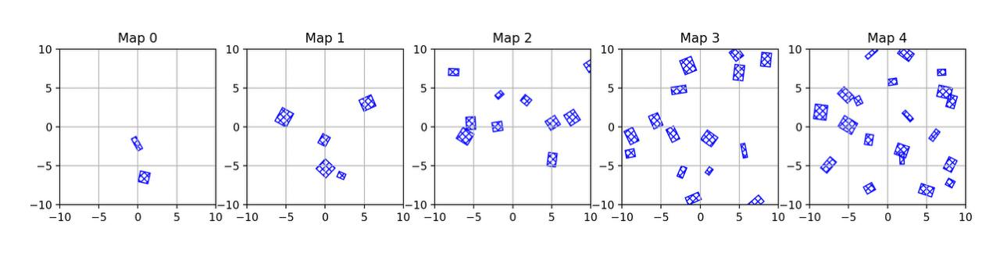
<figcaption>The generated maps used in this report</figcaption>
</figure>

# Nearest neighbors

*NN = Nearest Neighbors*

- Code

  - nearest_neighbors..py

- Graphics & Outputs

  - nearest_neighbors-nn_freeBody_config0,png

  - nearest_neighbors-nn_freeBody_config1,png

  - nearest_neighbors-nn_freeBody_config2,png

  - nearest_neighbors-nn_freeBody_config3,png

  <!-- -->

  - nearest_neighbors-nn_freeBody_config4,png

  - nearest_neighbors-nn_arm_config0.png

  - nearest_neighbors-nn_arm_config1.png

  - nearest_neighbors-nn_arm_config2.png

  - nearest_neighbors-nn_arm_config3.png

  - nearest_neighbors-nn_arm_config4.png

- Config Files

  - Arm

    - configs_arm_0.txt

    - configs_arm_1.txt

    - configs_arm_2.txt

    - configs_arm_3.txt

    - configs_arm_4.txt

  - Free Body

    - configs_freeBody_0.txt

    - configs_freeBody_1.txt

    - configs_freeBody_2.txt

    - configs_freeBody_3.txt

    - configs_freeBody_4.txt

First, I calculate the distance of between every pose and the start
pose. I store them in a list of (distance, pose). Then I sort that list
by distances, and return back the first k poses. This is linear time.
The free body distance is calculated with the L2 Norm of the x,y plus
the min distance between the angles. We need the min distance between
the angles, because the robot can rotate in either direction. The 2 Link
arm distance is calculated with the L2 norm between the min dist for
each angle in the pose. Since we use the min distance for the angles, we
respect the wrapping topology of angles.

For the images generated, the starting position of the free body was (0,
0, 0) with k = 10 and for the arm it was (0, 0) with k = 3.

<figure id="fig:enter-label" data-latex-placement="htbp!">

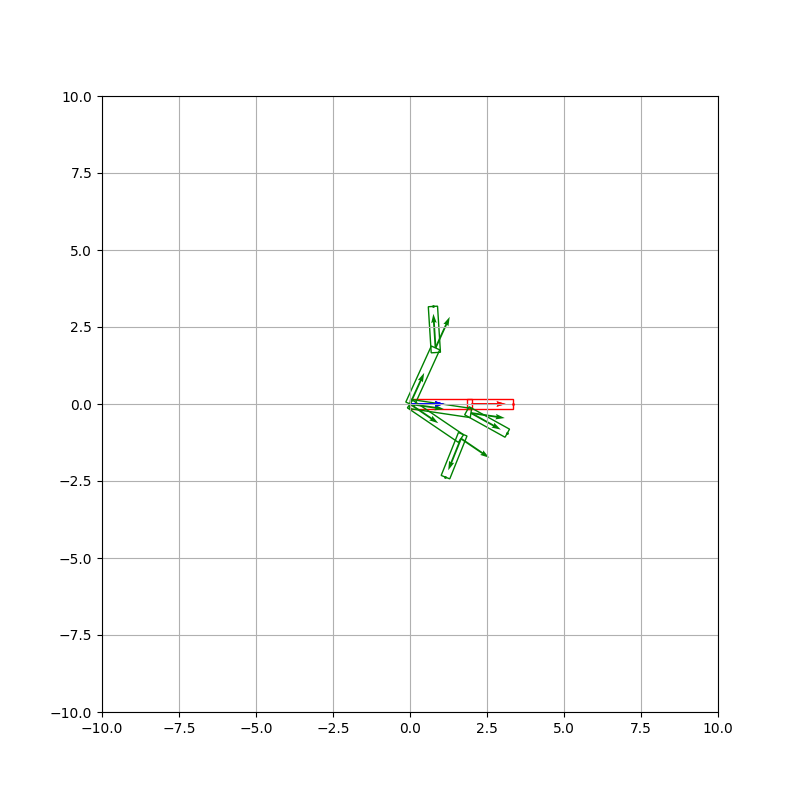 

<figcaption>nearest_neighbors-nn_arm_config0.png</figcaption>
</figure>

<figure id="fig:enter-label" data-latex-placement="htbp!">

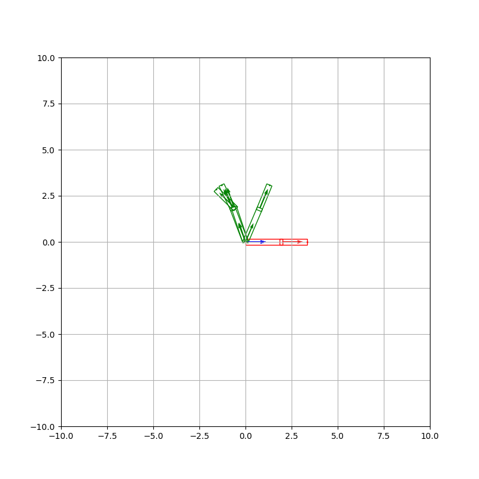 

<figcaption>nearest_neighbors-nn_arm_config1.png</figcaption>
</figure>

<figure id="fig:enter-label" data-latex-placement="htbp!">

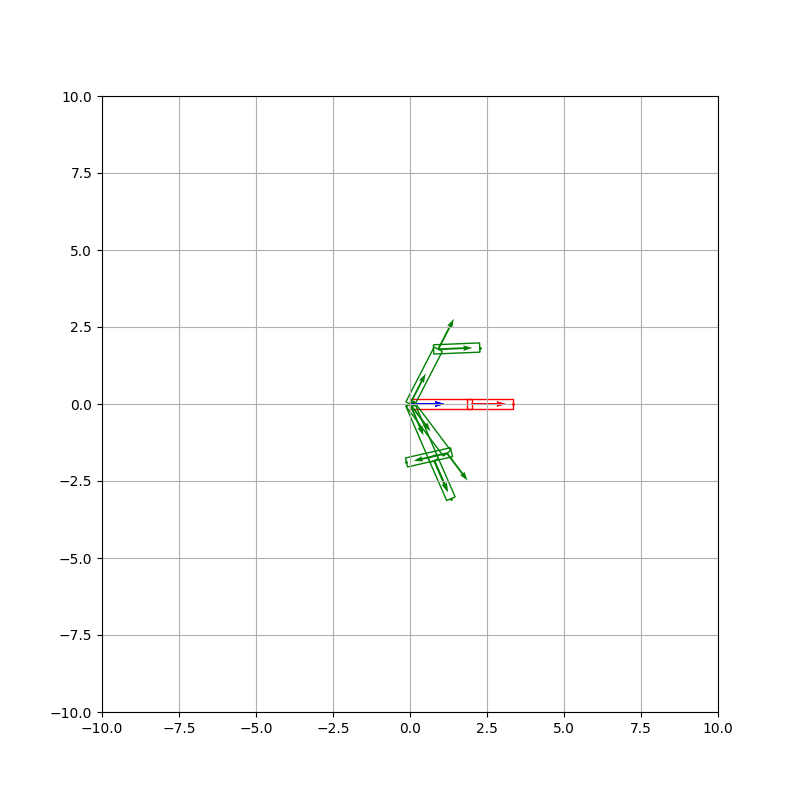 

<figcaption>nearest_neighbors-nn_arm_config2.png</figcaption>
</figure>

<figure id="fig:enter-label" data-latex-placement="htbp!">

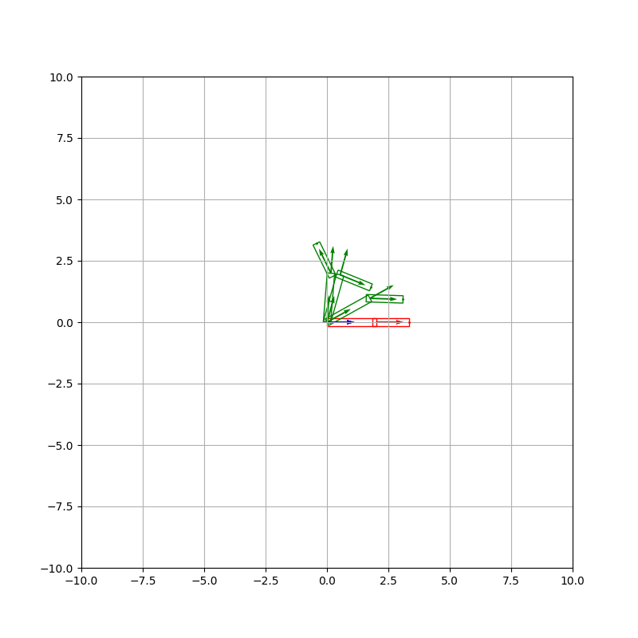 

<figcaption>nearest_neighbors-nn_arm_config3.png</figcaption>
</figure>

<figure id="fig:enter-label" data-latex-placement="htbp!">

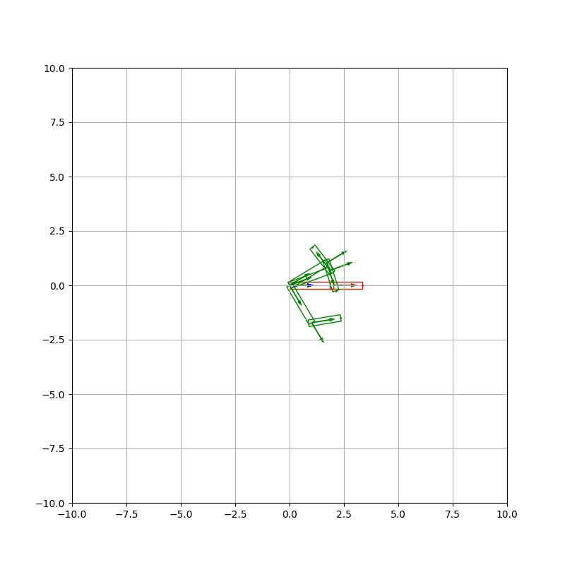 

<figcaption>nearest_neighbors-nn_arm_config4.png</figcaption>
</figure>

Figure 2 through Figure 6 show the three Nearst neighbors for the arm.
As you can see in the figure, the robot does not care of the direction
of the rotation, it just looks for the closets/min distance. For
example, in Figure 2, 4, 6, the robot picks robot in both directions of
rotation. If it did not account for the wrapping topology, the figures
would only show rotation in one direction. The only reason in Figure 3,
5 the robot picked poses in one rotation, is because in the other
direction, the poses were more "expensive." If you run the python code
with the variable "viewAll" as True, you will see poses in the other
direction had their second arm way further the actual nearst neightbors.
Therefor the NN function respects the topology and account for both
links.

<figure id="fig:enter-label" data-latex-placement="htbp!">
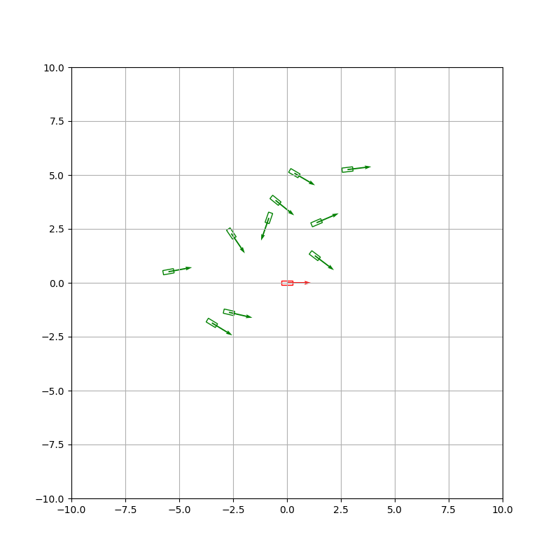
<figcaption>nearest_neighbors-nn_freeBody_config0.png</figcaption>
</figure>

<figure id="fig:enter-label" data-latex-placement="htbp!">
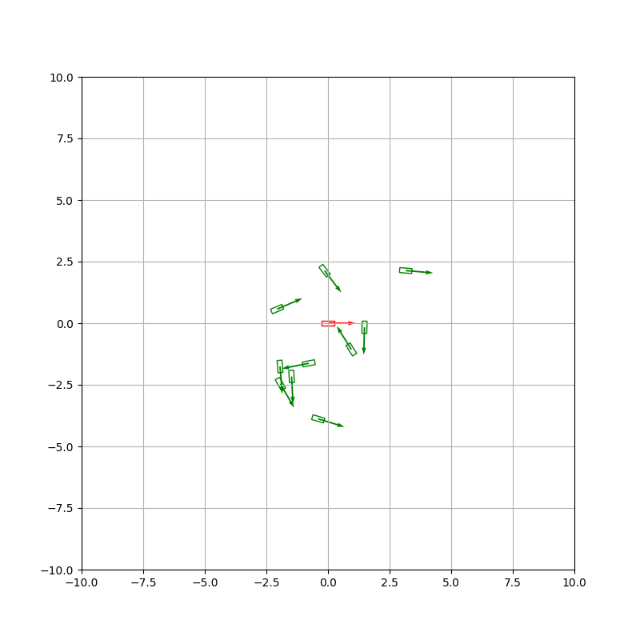
<figcaption>nearest_neighbors-nn_freeBody_config1.png</figcaption>
</figure>

<figure id="fig:enter-label" data-latex-placement="htbp!">
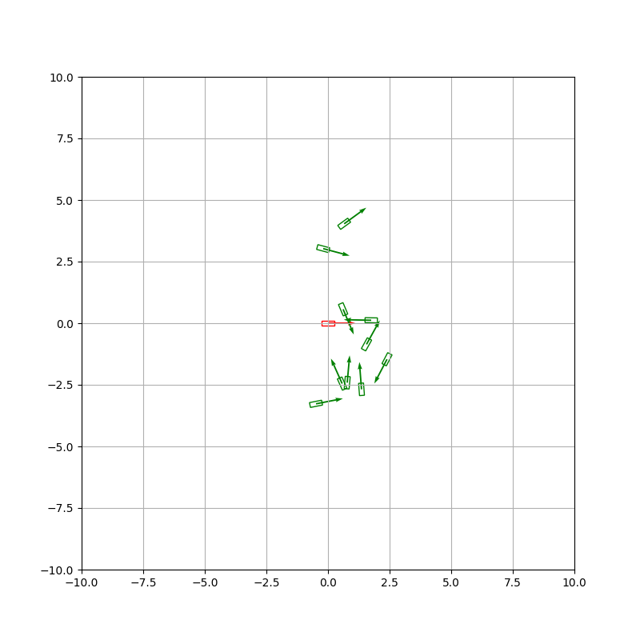
<figcaption>nearest_neighbors-nn_freeBody_config2.png</figcaption>
</figure>

<figure id="fig:enter-label" data-latex-placement="htbp!">
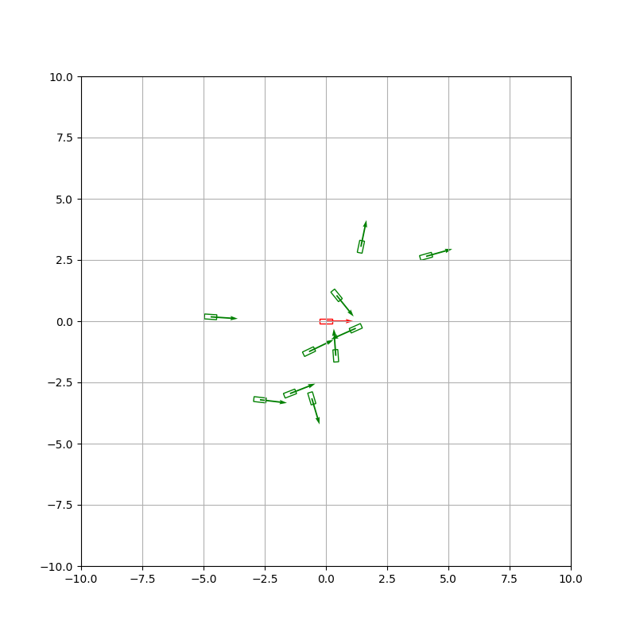
<figcaption>nearest_neighbors-nn_freeBody_config3.png</figcaption>
</figure>

<figure id="fig:enter-label" data-latex-placement="htbp!">
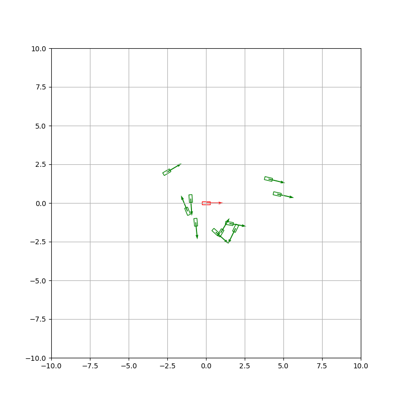
<figcaption>nearest_neighbors-nn_freeBody_config4.png</figcaption>
</figure>

Figures 7 through 11 show the 10 NN for the free body. The issue with
the distance method I used was that it implicitly "prioritized" the
angles more. That is because the angles in general have a higher
magnitude then the L2 norm distances. That is because they are in
different units, so when you add them you need to weight one of them. I
did not do that. That can be seen in the figures 7-11 where the robots
picked as closer might not "look" the closet, but they are due to the
formula I used.

# Collision checking

- Code

  - collision_checking.py

- Graphis & Output

  - Free Body

    - collision_checking-col_freeBody_map0.gif

    - collision_checking-col_freeBody_map1.gif

    - collision_checking-col_freeBody_map2.gif

    - collision_checking-col_freeBody_map3.gif

    - collision_checking-col_freeBody_map4.gif

  - Arm

    - collision_checking-col_arm_map0.gif

    - collision_checking-col_arm_map1.gif

    - collision_checking-col_arm_map2.gif

    - collision_checking-col_arm_map3.gif

    - collision_checking-col_arm_map4.gif

I used Separating Axis Theorem to implement collison checking. For the 2
link arm, I just treated each link as a rectangle, and did the SAT on
each one of them. If you run the code, their might be a lag on the first
frame, but I do not know what that is. Nevertheless, I animate 10 rand
poses and for each pose mark the colliding stuff in red. Figures 12 - 22
show 1 screenshot from each gif file listed above where a collision
happened. The screenshots are only for the report, and not put in the
submitted files on canvas. Please view the .gif files if you want to
view where the screenshots came from.

<figure id="fig:enter-label" data-latex-placement="htbp!">

<figcaption>collision_checking-col_arm_map0.png</figcaption>
</figure>

<figure id="fig:enter-label" data-latex-placement="htbp!">

<figcaption>collision_checking-col_arm_map1.png</figcaption>
</figure>

<figure id="fig:enter-label" data-latex-placement="htbp!">

<figcaption>collision_checking-col_arm_map2.png</figcaption>
</figure>

<figure id="fig:enter-label" data-latex-placement="htbp!">

<figcaption>collision_checking-col_arm_map3.png</figcaption>
</figure>

<figure id="fig:enter-label" data-latex-placement="htbp!">

<figcaption>collision_checking-col_arm_map4.png</figcaption>
</figure>

<figure id="fig:enter-label" data-latex-placement="htbp!">

<figcaption>collision_checking-col_freeBody_map0.png</figcaption>
</figure>

<figure id="fig:enter-label" data-latex-placement="htbp!">

<figcaption>collision_checking-col_freeBody_map1.png</figcaption>
</figure>

<figure id="fig:enter-label" data-latex-placement="htbp!">

<figcaption>collision_checking-col_freeBody_map2.png</figcaption>
</figure>

<figure id="fig:enter-label" data-latex-placement="htbp!">

<figcaption>collision_checking-col_freeBody_map3.png</figcaption>
</figure>

<figure id="fig:enter-label" data-latex-placement="htbp!">

<figcaption>collision_checking-col_freeBody_map4.png</figcaption>
</figure>

# PRM

- Code

  - prm.py

- Graphics & Outputs

  - Map 4

    - Free Body

      - prm_freeBody_map4_solution.mov

      - prm_freeBody_map4_graph.jpg

    - Arm

      - prm_arm_map4_solution.mov

      - prm_arm_map4_graph.jpg

  - Map 3

    - Free Body

      - prm_freeBody_map3_solution.mov

      - prm_freeBody_map3_graph.jpg

    - Arm

      - prm_arm_map3_solution.mov

      - prm_arm_map3_graph.jpg

All files are in the zip file.

The .mov files holds the robot moving through the environment. I screen
recording my screen, because the exporting from matplotlib was not
working. That is why they are .mov files because MacOS screen records in
.mov format. The .jpg show what the graph of PRM looks like. Since the
nodes are 5000, the graph is very dense. If you run PRM at lower nodes
say, 300, you can see the graph properly.

The animations might look like they hit the obstacles, but that is just
due to the thickness of the line. If you zoom into the actual matplotlib
plots after running the python file, you will see that the robot NEVER
hits an obstacle. I designed the environments in this way, to emulate a
narrow passage especially for the 2 link arm.

In the "make_prm" I implemented the prm algo. For sampling, I just
random samples the x, y and then random sampled the theta in from
$`-\pi`$ to $`\pi`$. I kept on sampling until I found a non colliding
pose. Then I got the k NN nodes in the graph. I added the rand pose
after that. Then for each of the k nn pose, I used the Local Planner
from HW1, which would return a discretized path from the rand pose to
the kth pose. If that path did not have collisions, then I would add
that as in edge. I checked collisions along a path by checking
collisions at each discretized pose returned by the local planner.

Then in the "query_prm" method I would attempt to connect the start and
the goal nodes to the graph. I would connect to the closet node that I
could get to without an obstacle in the way. Then I would run A\* Algo
to find the path,

# RRT

- Code

  - rrt.py

- Graphics & Outputs

  - Map 4

    - Free Body

      - rrt_freeBody_map4_solution.mov

      - rrt_freeBody_map4_tree.mov

    - Arm

      - rrt_arm_map4_solution.mov

      - rrt_arm_map4_tree.mov

  - Map 3

    - Free Body

      - rrt_freeBody_map3_solution.mov

      - rrt_freeBody_map3_tree.mov

    - Arm

      - rrt_arm_map3_solution.mov

      - rrt_arm_map3_tree.move

The trees are animated to show the growth. All files are in the zip
file.

For RRT, I used the same code from PRM, but some things got changed. I
first used a tree instead of a graph. So first I would random sample a
pose as described in PRM, but I would also sample the goal 5% of the
time as recommended in the pdf. This will help RRT get to the goal in
the limited number of iterations.

**To add edges to the tree**, I would get the nearest node to the rand
sample, and then use the steer function to steer towards that random
node a specific distance. The steer func returns a discretized path from
the nearst node to the new node a specfic distance away towards the rand
sample. If no collison occur along tha path, then I would add that edge
to the tree. Since this is a single query algo, I would directly run A\*
in the "make_rrt" method.

# AO Planner - PRM\*

- Code

  - AO_planner.py

- Graphics & Outputs

  - Map 4

    - Free Body

      - AO_planner-prm\*\_freeBody_map4_solution.mov

      - AO_planner-prm\*\_freeBody_map4_tree.jpg

    - Arm

      - AO_planner-prm\*\_arm_map4_solution.mov

      - AO_planner-prm\*\_arm_map4_tree.jpg

  - Map 3

    - Free Body

      - AO_planner-prm\*\_freeBody_map3_solution.mov

      - AO_planner-prm\*\_freeBody_map3_tree.jpg

    - Arm

      - AO_planner-prm\*\_arm_map3_solution.mov

      - AO_planner-prm\*\_arm_map3_tree.jpg

All files are in the zip file.

I decided to implement PRM\*. The only differnce between PRM and PRM\*
is that as the number of nodes increased, I returned k\*log(N)
neighboors. N is the number of nodes currently in the graph. k is a
constant at int(2e). This will cause more edges to formed as the number
of nodes increases, leading to a closer delta optimal path.

## Comparison

| **Map Number** | **Path Found %** | **AVG Run Time (s)** | **AVG Path Cost** |
|:--------------:|:----------------:|:--------------------:|:-----------------:|
|       0        |       1.0        |         2.28         |       4.18        |
|       1        |       1.0        |         3.90         |       3.28        |
|       2        |       1.0        |         6.71         |       4.35        |
|       3        |       1.0        |         9.28         |       4.68        |
|       4        |       1.0        |        12.66         |       3.75        |

PRM Arm Robot Testing Results. Each map run 10 times

| **Map Number** | **Path Found %** | **AVG Run Time (s)** | **AVG Path Cost** |
|:--------------:|:----------------:|:--------------------:|:-----------------:|
|       0        |       1.0        |         0.89         |       6.04        |
|       1        |       1.0        |         1.10         |       4.42        |
|       2        |       1.0        |         1.53         |       6.08        |
|       3        |       1.0        |         1.93         |       6.75        |
|       4        |       1.0        |         2.46         |       5.47        |

RRT Arm Robot Testing Results. Each map run 10 times

| **Map Number** | **Path Found %** | **AVG Run Time (s)** | **AVG Path Cost** |
|:--------------:|:----------------:|:--------------------:|:-----------------:|
|       0        |       1.0        |        11.99         |       4.01        |
|       1        |       1.0        |        23.15         |       3.15        |
|       2        |       1.0        |        44.13         |       4.12        |
|       3        |       1.0        |        62.52         |       4.42        |
|       4        |       1.0        |        86.69         |       3.31        |

PMR\* Robot Testing Results. Each map run 10 times

| **Map Number** | **Path Found %** | **AVG Run Time (s)** | **AVG Path Cost** |
|:--------------:|:----------------:|:--------------------:|:-----------------:|
|       0        |       1.0        |         5.63         |       31.48       |
|       1        |       1.0        |        11.70         |       30.99       |
|       2        |       1.0        |        22.18         |       24.01       |
|       3        |       0.8        |        33.00         |       30.63       |
|       4        |       1.0        |        41.69         |       24.94       |

PRM FreeBody Robot Testing Results. Each map run 10 times

| **Map Number** | **Path Found %** | **AVG Run Time (s)** | **AVG Path Cost** |
|:--------------:|:----------------:|:--------------------:|:-----------------:|
|       0        |       1.0        |         0.73         |       37.29       |
|       1        |       1.0        |         1.01         |       35.89       |
|       2        |       0.8        |         1.53         |       25.60       |
|       3        |       0.3        |         2.21         |       31.38       |
|       4        |       0.4        |         2.71         |       31.99       |

RRT FreeBody Robot Testing Results. Each map run 10 times

| **Map Number** | **Path Found %** | **AVG Run Time (s)** | **AVG Path Cost** |
|:--------------:|:----------------:|:--------------------:|:-----------------:|
|       0        |       1.0        |        34.96         |       28.28       |
|       1        |       1.0        |        75.66         |       28.75       |
|       2        |       1.0        |        145.05        |       20.32       |
|       3        |       1.0        |        211.10        |       24.93       |
|       4        |       1.0        |        321.12        |       23.89       |

PRM\* FreeBody Robot Testing Results. Each map run 10 times

The pdf questions did not say to explain the results. But in general,
rrt was the fastest, but prm\* returned the most optimal paths.
